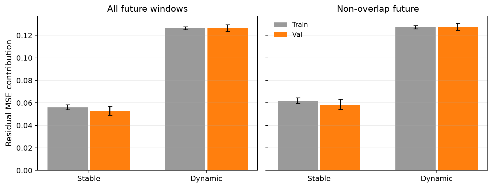
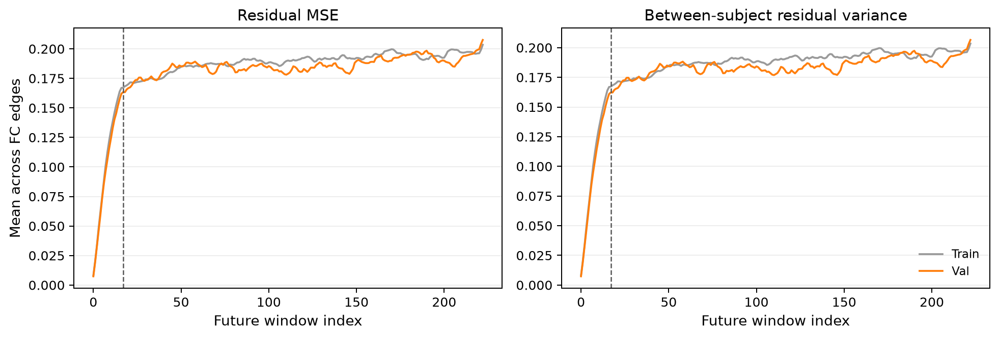

# E0032 真实残差的稳定与动态成分审计

定义：`r[s,t,e]=y[s,t,e]-B[s,t,e]`，其中 `B=g[t,e]+alpha[t]*(FC1[s,e]-g0[e])`。
各区间分别计算 `m[s,e]=mean_t(r)` 与 `d[s,t,e]=r-m`；因此全程与长期的稳定成分定义不同。
所有模板和 alpha 沿用 E0032 训练折产物；验证未来 FC 只用于本次审计。

| 划分与区间 | 被试 | 残差 MSE | 稳定 MSE | 动态 MSE | 稳定占比 | 动态被试间相关 |
| --- | ---: | ---: | ---: | ---: | ---: | ---: |
| train / full | 738 | 0.182415 | 0.056092 | 0.126322 | 30.75% | -0.001348 |
| val / full | 158 | 0.179054 | 0.052666 | 0.126389 | 29.41% | 0.000981 |
| train / long | 738 | 0.189088 | 0.061850 | 0.127238 | 32.71% | -0.001348 |
| val / long | 158 | 0.185801 | 0.058327 | 0.127474 | 31.39% | 0.001011 |

## 长期验证集细节

- 长期为未来标签索引 `[17, 223)`，共 206 个窗口；稳定成分的 RMS 为 0.241510，动态成分的 RMS 为 0.357035。
- 稳定占比的被试 bootstrap 95% 区间为 [29.72%, 33.22%]。
- 稳定残差的跨被试方差（对边平均）为 0.057978；动态残差的跨被试方差（对时距和边平均）为 0.126544。
- 动态残差的平均跨被试 Pearson 为 0.001011；共享轨迹能量占比为 0.73%，接近 158 人独立波动的有限样本基准 0.63%。
- 相邻未来窗口的动态残差相关为 0.962032（训练集 0.962079）。相邻滑窗高度重叠，此值不能单独当作可预测性。
- 把长期窗口分为 `[17, 120)` 与 `[120, 223)` 两半，真实稳定残差的同被试跨半段边 Pearson 均值为 0.570623（非本人均值 0.000984；训练集本人均值 0.586291）；验证集跨半段身份匹配 Top-1/Top-5 为 96.20% / 98.73%，随机期望为 0.63% / 3.16%。这只检验目标在同一次扫描内的延续性。
- 训练集动态残差的跨被试平均相关略为负值，是训练模板逐时距居中后的有限样本恒等关系，不能解释为反相关现象。
- 稳定 MSE + 动态 MSE = 残差 MSE；这些是使用真实未来 FC 的目标能量，属于理想预测上限的拆分，不代表 FC1 或 SC 已能预测相应成分。

## 图

完整逐时距数值见 `E0032_true_residual_audit.json`，逐被试指标见 `E0032_true_residual_per_subject.csv`。
