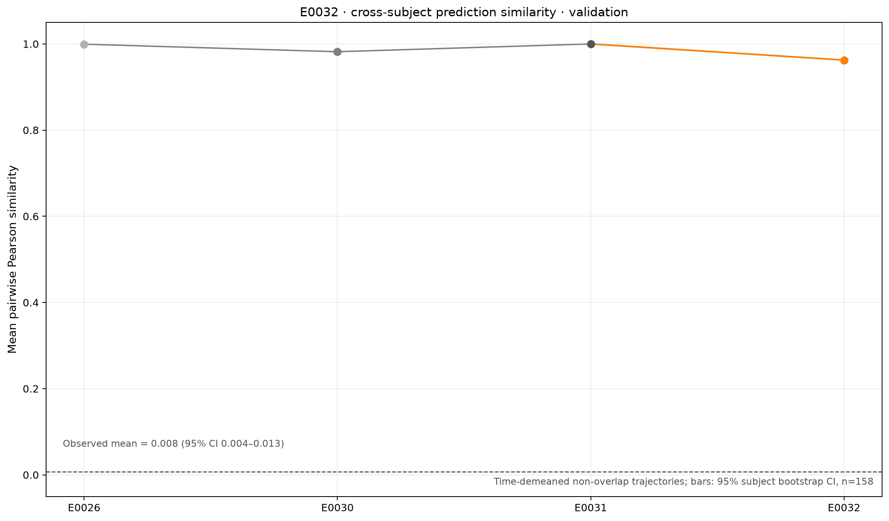
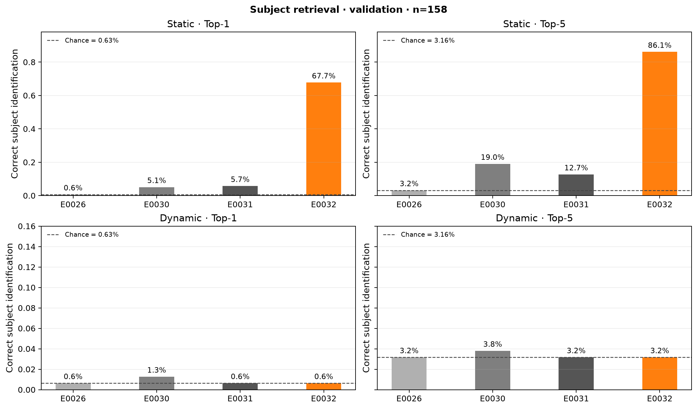
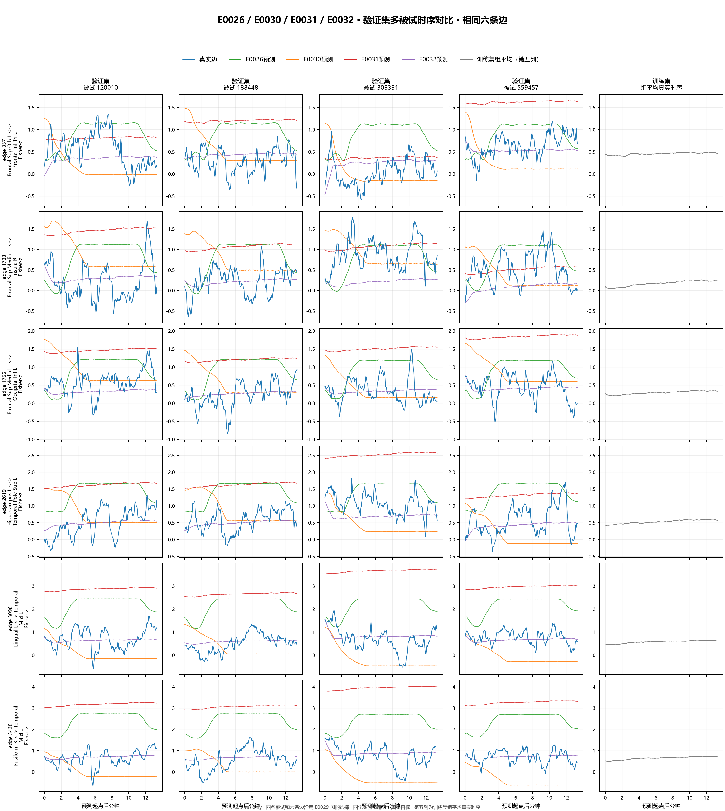

# 被试间预测相似性与 Top-k

比较 E0026、E0030、E0031、E0032 的最佳检查点和 E0032 解析基线，使用相同的 158 名验证被试。以下分析只用验证集。

## 口径

- **静态 Top-k**：沿用项目现有的未来平均 FC 被试检索，预测的非重叠未来平均 FC 与每位候选被试的真实未来平均 FC 做边 Pearson 相似度排序。
- **动态 Top-k**：将预测与真实非重叠轨迹分别对每名被试、每条边沿时间去均值，再展平全部时间和边；用 Pearson 相似度将每名被试的预测轨迹与所有人的真实轨迹排序。随机基准为 Top-1 `1/158 = 0.63%`、Top-5 `5/158 = 3.16%`、Top-10 `10/158 = 6.33%`。
- **跨被试预测相似性**：同一模型下，计算每对不同被试的去时间均值预测轨迹 Pearson 相关，并对被试重抽样生成 95% bootstrap 区间。真实轨迹的两两相关作为参照。若预测轨迹彼此接近 1，而真实轨迹两两相关接近 0，表示模型对不同被试给出了相似的动态形状。
- Top-k 的动态定义是本次新增诊断，不等同于原评价报告中的静态检索 Top-k。被试间相关的区间按被试为单位 bootstrap，不把被试对误当作独立样本。

## 汇总

| 实验 | 预测间动态相似度（均值，95% CI） | 静态 Top-1 / Top-5 | 动态 Top-1 / Top-5 / Top-10 | 动态平均名次 |
| --- | ---: | ---: | ---: | ---: |
| E0026 | 0.9994 `[0.9993, 0.9995]` | 0.63% / 3.16% | 0.63% / 3.16% / 6.33% | 79.54 |
| E0030 | 0.9819 `[0.9803, 0.9835]` | 5.06% / 18.99% | 1.27% / 3.80% / 6.33% | 79.20 |
| E0031 | ≈1.0000 `[≈1.0000, ≈1.0000]` | 5.70% / 12.66% | 0.63% / 3.16% / 6.33% | 79.50 |
| E0032 | 0.9625 `[0.9603, 0.9645]` | 67.72% / 86.08% | 0.63% / 3.16% / 6.33% | 78.49 |
| 真实验证轨迹两两相似度 | 0.0076 `[0.0036, 0.0125]` | — | — | — |

E0032 把不同被试预测轨迹的平均相关从 E0031 的约 `1.000` 降至 `0.963`，但仍远高于真实轨迹的 `0.008`。四个实验的动态 Top-5 都在随机水平附近；E0030 的 `3.80%` 只对应 158 人中 6 人命中，随机期望约为 5 人。E0032 的强项是静态未来平均 FC 的身份检索，不能据此说它恢复了个人动态轨迹。

E0032 的平均动态本人匹配优势（本人真实轨迹相似度减去其他人真实轨迹平均相似度）为 `0.0036`；E0026 为 `-0.0001`、E0030 为 `0.0011`、E0031 约为 `0.0000`。这一差异仍很小，与接近随机的 Top-k 一致。

## 图表

多被试时序图沿用此前实验的固定六条边和四名验证被试，蓝线为真实轨迹，E0026、E0030、E0031、E0032 各用一种颜色，第五列显示训练集组平均真实时序。被试和边与 E0029 旧图一致，便于横向比较。

图表生成脚本：`analyze_subject_similarity.py`、`generate_similarity_report.py`、`build_old_style_multisubject_comparison.py`。
