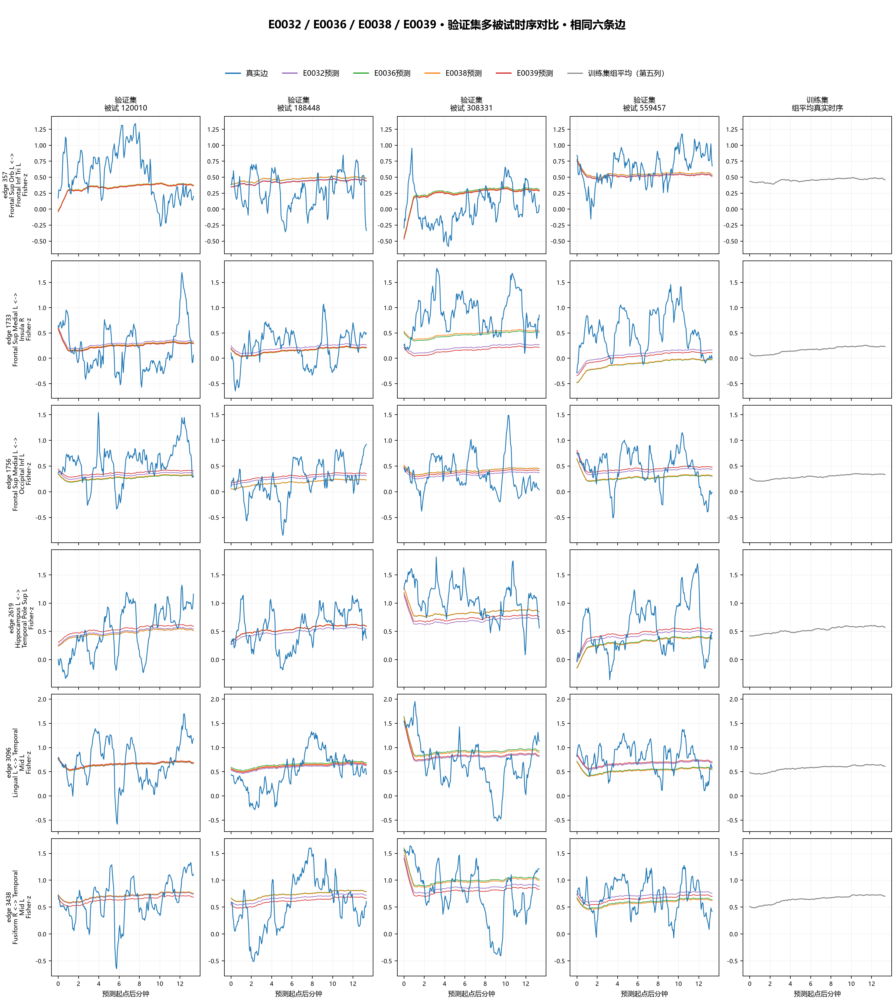
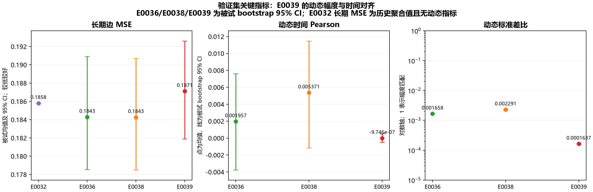

# E0039 validation visual analysis

Both figures use validation data only. The multi-subject time-series figure follows the E0032 six-edge layout and reuses the same four subjects and six edges selected by E0029. Each column uses a shared y range for the same edge; the training-set group mean appears in the final column.

The E0039 predictions are smooth and follow the shared low-frequency trajectory, while the measured curves vary much more. This matches the aggregate dynamic standard-deviation ratio of 0.000164 and dynamic time Pearson near zero.

The metric plot includes subject-bootstrap 95% intervals for E0036, E0038, and E0039. E0032's historical evaluation report has aggregate long MSE but does not record per-subject long MSE or the newer dynamic-time metrics, so its long MSE is shown as a point without an interval and it is omitted from the dynamic panels.

Regenerate both figures with `python outputs/E0039/visual/build_e0039_visual_analysis.py`. The script reads the immutable run configs/checkpoints and the fixed E0029 subject/edge selection manifest.
